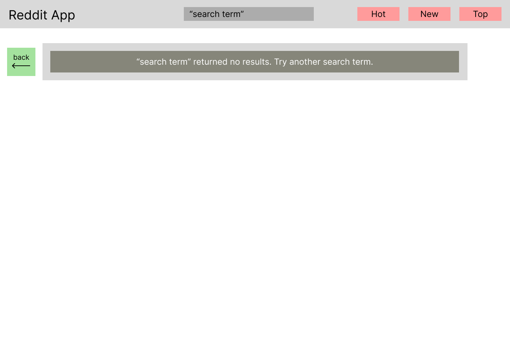

# Opposite Reddit App

Welcome to the **Opposite Reddit** app! This is a fun, experimental version of Reddit where everything you search for returns the opposite of what you typed. The project is built using **React**, **Tailwind CSS**, and **Fake Local Data** (with plans to integrate the Reddit API in the future).


## Features

- **Custom-designed Reddit posts**: View posts with associated subreddits and images.
- **Opposite-Reddit functionality**: Search terms will return the opposite of what you typed in.
- **Responsive design**: The app is fully responsive, built with Tailwind CSS, and works across devices.
- **Sample data**: The app is preloaded with fake data for testing and demo purposes.
  

## Tech Stack

- **React**: A JavaScript library for building user interfaces.
- **Tailwind CSS**: A utility-first CSS framework.
- **PropTypes**: For type-checking props in React components.
- **Fake Data**: For testing the app before using the actual Reddit API.


## Design and Wireframes

Below are the initial wireframes that helped shape the design and structure of the app:

### Homepage Wireframe


### Search Results & Error Wireframe




### Post Details Wireframe


---

The wireframes provided a foundation for building a responsive and user-friendly interface.

## Installation

If you'd like to run this project locally or contribute to its development, follow these steps:

1. **Clone the repository**:

   ```bash
   git clone https://github.com/funky-duckling/Portfolio-Project---Reddit.git
   cd Portfolio-Project---Reddit.git
   ```
   
   Install dependencies:

   ```
   npm install
   ```
   
   Run the app:
   
   ```
   npm run dev
   ```

   The app should now be available at http://localhost:5173.
   

## Usage

Once the app is running:

1. You will see a NavBar with options such as "Top", "New", and "Hot".
2. The search bar allows you to search for posts, and the search results will show the opposite of what you type.
3. Click on individual posts to see the subreddit, title, content, and an image (if available).
4. Each post is displayed in a card with the number of upvotes and comments.

## Roadmap

- Integrate the Reddit API for live data fetching.
- Add more customization options for posts and filtering.
- Improve performance and add testing.

